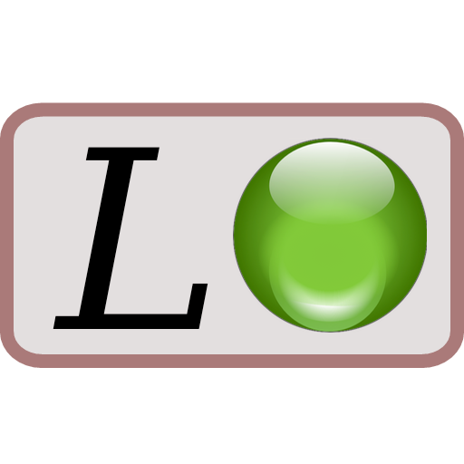

# webLurch Documentation

[Lurch is a mathematical word processor](http://lurchmath.org) that checks
the reasoning in users' documents, even mathematical proofs.

*This project is rewriting Lurch for the web.*

Use the menus at the top to find what you're looking for.

A better landing page is coming soon.

