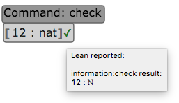
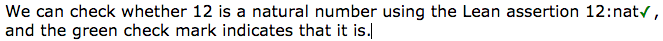

# Lean App Tutorial, Part 2

This page assumes you've read [Part 1](tutorial-1.md).

[Try the web app live now.](http://nathancarter.github.io/weblurch/app/lean-example.html)

The end of that document pointed out a needed improvement:  The bubbles in a
document all contain Lean code, which expects the reader to be fluent in it.
Let's see a first step towards reducing that problem.

## Hiding Commands

In the previous part of the tutorial, we saw that entire Lean commands can
be embedded in a bubble, like so:

If you wish to hide the command, leaving only the mathematical content (in
this case an expression in the language of dependent type theory),
right-click the bubble and choose the "Edit command..." item from the
context menu.  Specify the command there, and you may then remove it from
the bubble.  It will appear on the bubble's tag, and function as if it were
inside the bubble, at the beginning, as shown here.

## So what?

### Benefits

Now Lean code can be more naturally worked into the surrounding prose, as
shown in the example below.

(The square brackets have been hidden in this example, using the View menu.)

### Missing pieces

Many additional aspects of Lean syntax must still be placed inside term
bubbles, most notably the `a : A` notation at the heart of dependent type
theory.  Let's address that now:

[Continue to Part 3.](tutorial-3.md)
