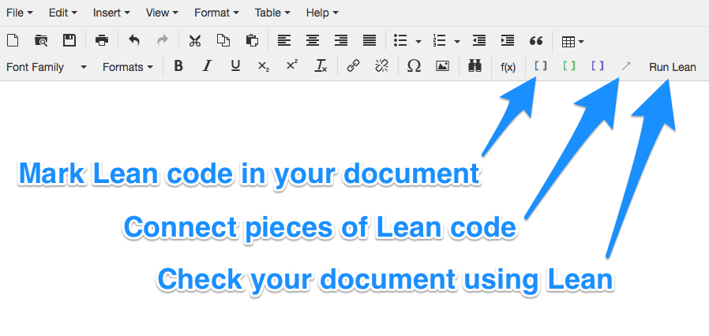
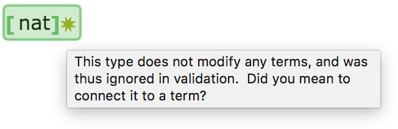

# Lean App Tutorial, Part 3

This page assumes you've read Parts [1](tutorial-1.md) and
[2](tutorial-2.md).

[Try the web app live now.](http://nathancarter.github.io/weblurch/app/lean-example.html)

[Part 2](tutorial-2.md) ended by pointing out that the UI could be better
if the common syntactic form `a : A` in Lean were supported in this app.
This page of the tutorial introduces how it's supported.

## Type Groups

Next to the toolbar button that wraps text in a "term" bubble is a button
for wrapping text in a "type" bubble.  While term bubbles are gray, type
bubbles are green.  The toolbar button for marking text as a type is
immediately to the right of that for marking text as a term.

If you mark something as a type in your document, however, and click "Run
Lean," it will say that the type is not attached to any term, and thus
cannot be validated on its own.  (The gold starburst indicates a warning,
as opposed to an outright error.)

## Connecting Types to Terms

To connect one bubble to another (such as a type to the term it modifies),
use the connection button in the toolbar, labeled "Connect pieces of Lean
code" in the image below.

Follow this process:

 1. Place your cursor inside the type bubble.
 1. Click the arrow button shown in the image above.
 1. Click inside the term that it modifies.

This connects the type to the term visually on screen, with an arrow.  It
also permits you to separate the type and the term in your text, and let the
text flow as smoothly as you'd like around them.  The type can precede the
term, or follow it.  Here is an example.

To disconnect a type and a term, just perform the connection process again.
It toggles the connection off.

## Validation

When you "Run Lean" on a document with the configuration shown above, the
type is treated as modifying the term.  If the term has a "check" command
embedded in it, for instance, the check will include the type assertion, as
shown here.

## So what?

### Benefits

The idea introduced above makes further progress in permitting you as a
document author to structure your text as you see fit, without needing to
be bound by the notational conventions of Lean.  The example images above
show how you can structure your prose as you like, and fit bubbles and
connections among them into your prose in whatever way it necessitates.

Note that the visual clutter shown above completely disappears when the user
takes their cursor out of the bubbles in question.  The image below shows
the document with validation complete (so the green checks are present) but
with bubble boundaries hidden (from the View menu).

### Missing pieces

Of course, there are still occasions where some Lean syntax is unavoidable.
For instance, in the code `definition A : B := C`, we have no way to
separate the `C` (which may be a very large expression) from the rest.
We'll see how to solve that problem next.

[Continue to Part 4.](tutorial-4.md)
