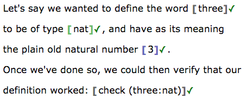
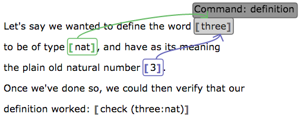

# Lean App Tutorial, Part 4

This page assumes you've read Parts [1](tutorial-1.md), [2](tutorial-2.md),
and [3](tutorial-3.md).

[Try the web app live now.](http://nathancarter.github.io/weblurch/app/lean-example.html)

The end of [Part 3](tutorial-3.md) pointed out that Lean definitions (and
hence theorems and examples) cannot yet have their body split out from the
rest of the code.  This tutorial page solves that problem.

## Body Groups

In Lean, theorems, defintions, and examples are all of the form
`definition name : type := body`, where the word "definition" may instead be
"theorem" or "example."  This is the next syntax we permit breaking out.  We
call the final element of that structure the "body" and have a new bubble
type for it in the app.

## Example 1: A Definition

Let's assume that we want to write a document embodying the Lean code
`definition three : nat := 3`.  Certainly, we could simply put that code
inside a term bubble, but that requires our document to contain Lean
syntax.  Here is an alternate way.

This document has plenty of non-bubbled text that is irrelevant to the
results of the "Run Lean" operation, which pays attention only to the
contents of the bubbles.  But that non-bubbled text is very helpful, for
somewhat obvious reasons (also described [at the end of this
page](#benefits)).

If we use the View menu to show the boundaries of the bubbles then the
result looks like the following.

Notice that the app can convert these broken-apart pieces into Lean code
correctly, so that it validates.

The type is connected to the term in the manner introduced in [the previous
part of this tutorial](tutorial-3.md).  But the body is also connected in
the same way, as shown here.

## Creating the Structure

To create a body group, use the blue bracket button in the toolbar below
(third button of those labeled "Mark Lean code in your document").

To connect a body to the term being defined (or the statement of a theorem,
using the body as its proof), use the same technique as discussed in [the
previous part of this tutorial](tutorial-3.md):

 1. Place your cursor inside the body bubble.
 1. Click the arrow button in the toolbar.
 1. Click inside the term for which that body is the definition or proof.

## What goes inside

A body bubble's contents, if they are just plain text, are interpreted like
the contents of a term bubble.  This is how the example above works.  But
that is just the simplest of the ways you can use a body bubble.  Here is a
comprehensive list.

 * If a body bubble contains no other bubbles, then its text content is
   interpreted as the Lean code for a term (as above).
 * If a body bubble contains a single term bubble, then the body bubble's
   meaning is the same as that of the single term bubble.
 * If a body bubble contains n term bubbles, then the first n-1 are seen as
   parameters and the final one is seen as the body of a lambda expression.
   Thus for example, the structure shown below defines a function.  It could
   be used as the body of a definition.

The second case is a generalization of the first, permitting explanatory
text outside the inner bubble; the first case can be seen as shorthand for
the second.  The third case is more general still, because the second case
is the 0-parameter version of the third case.

## Example 2: Theorem and Proof

This permits us to put a little exposition in our theorems and proofs, as
shown in the following image.

The structure that reveals itself when your cursor is inside the main term
(the name and premises of the theorem) is as shown below.

In these examples, I've placed a term bubble inside the body bubble, which
shows that the meaning is the same.

## So what?

### Benefits

This lets us make more readable definitions and theorems, as shown above.
The expository text between bubbles has two main benefits.  A human reader
can understand the document without thinking through Lean syntax.  And the
document author, when that writer is a student, can practice expressing
mathematical proofs in a readable and understandable way, and have that
exposition evaluated by an instructor.

### Missing pieces

The definition and proof shown above are both very short.  If they were
longer, there would be very large, indivisible term bubbles in the document,
which cannot contain prose comments.  Let's see how to fix that.

[Continue to Part 5.](tutorial-5.md)
