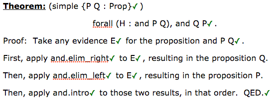
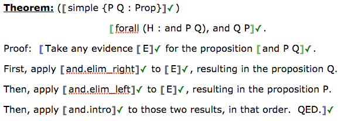
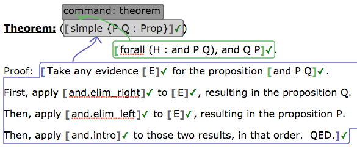
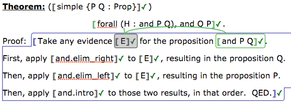
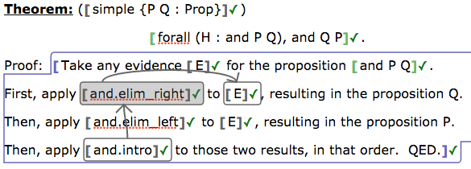

# Lean App Tutorial, Part 5

This page assumes you've read Parts [1](tutorial-1.md), [2](tutorial-2.md),
[3](tutorial-3.md), and [4](tutorial-4.md).

[Try the web app live now.](http://nathancarter.github.io/weblurch/app/lean-example.html)

The end of [Part 4](tutorial-4.md) pointed out that while the bodies of Lean
definitions, theorems, and examples can be split out from the name and type
of the definition, etc., they remain indivisible, which presents a challenge
to inserting helpful exposition among them.

## Term Trees

Consider a Lean term like `and.intro (and.elim_right E) (and.elim_left E)`,
which would appear in the proof of the commutativity of the conjunction
operator.  This term is nested applications, a syntax tree.  We could
diagram its hierarchical structure as follows.

    and.intro
        and.elim_right
            E
        and.elim_left
            E

In a document, it is inconvenient to have to place all these symbols one
after another, because they prevent our inserting exposition between them.
This is especially true since this is only a small example, and much larger
proofs are common.

We would like to do something more like the following.

This is possible by breaking the syntax tree for the proof term into
smaller pieces, which we then connect with arrows, so that the app knows
how to reconstruct the original Lean code from the pieces.

## Building Term Trees

If you have a term of the form `operator operand1 ... operandN` in a
document, and you wish to break it up, do so as follows.

 1. Break the term bubble surrounding the term.  (Do so by using the delete
    or backspace key on either of its boundaries.)
 1. Place a new term bubble around just the operator.
 1. Place a new term bubble around the first operand.
 1. Use the arrow button on the toolbar to connect the operator to that
    operand.
 1. Repeat the last two steps for the second operand, and the third, and so
    on.

The app will understand that the source of the arrows is the operator, and
the destinations are the operands.  The order of the arrows is significant,
and is displayed by the order in which the arrows leave the operator bubble.
To destroy arrows and reform them, simply repeat the connecting process, and
the arrow will be toggled off; this can help you reorder them.

Note that the operator and operands do not need to appear in the document in
the order in which they would appear in Lean code.  As long as the arrows
exist in the correct direction and the correct order, the bubbles themselves
can appear in any sequence.

## Example

Consider the image shown earlier on this page.  Here is how it was created.
Bubbles were placed as follows:

Connections were made from the theorem statement and body to the theorem
name in the way you already know from [the previous tutorial page](tutorial-4.md):

Inside a body, the first terms are treated as parameters, which in the case
of proofs means that they function as assumptions.  In this proof, we have
one assumption, which should be assigned a type as shown here.

Each of the elimination steps in the body is applied to its argument, and in
turn, has the introduction step applied to it.  Thus the remainder of the
theorem body is actually just one large term, split out into five bubbles,
forming one term tree.  In the following image, the cursor is in the shaded
bubble, so you can see only the arrows into and out of that bubble.  There
are corresponding arrows into and out of the `and.elim_left` step as well.

Thus the set of arrows connecting the last five term bubbles in the proof
form the same tree shown at the top of this page, with the arrows pointing
from each term to its subterm(s).

## So what?

### Benefits

As you can see from the example in this document, we can now begin to write
theorems in a much more natural style, with as much exposition between
steps as we find necessary.

In fact, the example shows that we can even reorder the elements of the
proof term to be in whatever sequence we feel natural; the introduction
step, which would appear first in the Lean code
`and.intro (and.elim_right E) (and.elim_left E)`, appears last in the
document.

### Missing pieces

The statement of the theorem still contains the ugly code bit
`{P Q : Prop}`, which we have not yet learned to eliminate.  Let's do that
next.

[Continue to Part 6.](tutorial-6.md)
