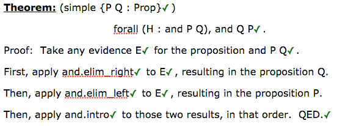
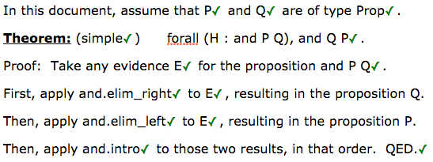
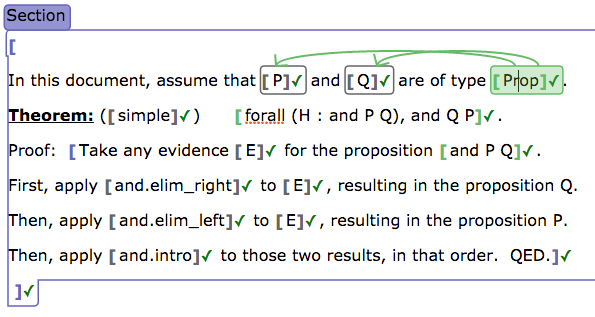

# Lean App Tutorial, Part 6

This page assumes you've read Parts [1](tutorial-1.md), [2](tutorial-2.md),
[3](tutorial-3.md), [4](tutorial-4.md), and [5](tutorial-5.md).

[Try the web app live now.](http://nathancarter.github.io/weblurch/app/lean-example.html)

The end of [Part 5](tutorial-5.md) promised to take code like `{P Q : Prop}`
out of the names of theorems, and this tutorial page shows how.

## Sections

Recall the nicely organized theorem from [the previous tutorial
page](tutorial-5.md).

The one complaint we had about it was that its statement had to contain the
declarations of the variables `P` and `Q`, using the Lean syntax
`simple {P Q : Prop}`.  To make our documents more readable, we would like
something more like the following.

This can be accomplished very simply, as follows.

 1. Create a term bubble for each variable, before the theorem.
 1. Embed in each such term bubble the Lean command "variable"
    (as in [Part 2 of the tutorial](tutorial-2.md)).
 1. Assign a type to each such bubble (or the same type to more than one)
    (as in [Part 3 of the tutorial](tutorial-3.md)).
 1. Wrap the variable terms and the theorem in one, large body bubble.
    Do not connect it to anything via arrows.

Such disconnected body bubbles function as "sections" in Lean code, and will
thus localize the variable declarations to the theorem only (unless you
place other theorems inside the same body, of course).

The bubble structure described above is shown here.

## So what?

### Benefits

We have further cleaned up the syntax for stating and proving theorems.
There is now almost no Lean syntax in the theorem at all!

### Missing pieces

If we can create Lean `section`s, why not Lean `namespace`s?  We can!

[Continue to Part 7.](tutorial-7.md)
