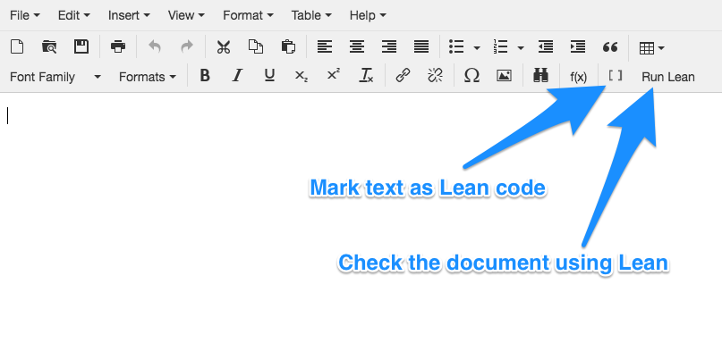
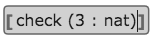
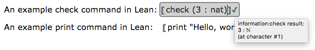

# Lean App Tutorial, Part 1

The webLurch project is factored into two parts, as described
[here](../README.md#a-development-platform).  The main app is built on a
foundation that can be re-used to make many different apps.
One of the [example
applications](http://nathancarter.github.io/weblurch/app/index.html)
built on that foundation uses the software
[Lean](http://leanprover.github.io/) (actually, its
[JavaScript implementation](https://github.com/leanprover/lean.js))
to validate documents expressing mathematics using dependant type theory.

## What does it do?

This tutorial assumes that you're familiar with Lean.  If not, consider
starting with [Lean's own tutorial](https://leanprover.github.io/tutorial/)
first.

The app itself is [available online
here](http://nathancarter.github.io/weblurch/app/lean-example.html).
It is a word processor whose controls are self-explanatory, with two new
features.

### Marking Lean code

The two buttons on the toolbar above provide a way for users to mark
sections of their document as Lean code and to have those sections checked
for validity.

The button whose icon is two square brackets, `[ ]`, can be used to wrap
selected text in special square brackets that tell the app that that the
contents are to be interpreted as Lean code.  When the user's cursor is
inside such code, a bubble will be drawn around the code to make that fact
visually obvious.

Users who do not wish to see the brackets (and rely
instead only on the bubbles that appear when the cursor is inside the code)
can toggle that feature using the View menu.

### Checking with Lean

The collection of Lean code in the document can be run through Lean in one
step using the "Run Lean" button in the toolbar.  This can take several
seconds, since running a sophisticated application like Lean in a browser
window is a nontrivial operation.  Thus it is only run when the user
explicitly clicks the button.

After it has been run, bubbles that produced any kind of output are
decorated with a symbol, either &#10003; or &#10006;, indicating whether the message was an error.  You
can find details about the Lean output by hovering your mouse over the
symbol in question, as shown below.

## So what?

### Benefits

This means there is a simple UI in which you can type
[literate](https://en.wikipedia.org/wiki/Literate_programming) Lean code,
and it looks nice.  Furthermore, the validation results are presented as
nicely as they are in [the official online Lean
environment](https://leanprover.github.io/tutorial/?live).

### Missing pieces

There are many disadvantages to the simple app just demonstrated, many of
which will be addressed individually in later pages in this tutorial.  The
first disadvantage that comes to mind is that the reader still needs to
speak Lean code rather fluently (e.g., `check` and `print` and other
commands) to use this software.  How might we improve that?  Let's see:

[Continue to Part 2.](tutorial-2.md)
