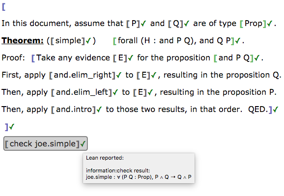

# Lean App Tutorial, Part 7

This page assumes you've read Parts [1](tutorial-1.md), [2](tutorial-2.md),
[3](tutorial-3.md), [4](tutorial-4.md), [5](tutorial-5.md), and
[6](tutorial-6.md).

The end of [Part 6](tutorial-6.md) stated that you can use Lean namespaces
just as easily as Lean sections.  This tutorial page covers how to do so.

## Namespaces

Recall the beautiful theorem from [the previous tutorial page](tutorial-6.md).

We could do the same thing in a namespace rather than a section, if we
wanted to.  (We might want to in order to avoid filling the global
namespace with too many identifiers, or to organize our code, or to prevent
a clash with an existing theorem name, etc.)

It is a simple matter to change a section into a namespace, or vice versa.

 1. Right-click any text inside the Section bubble (but not inside any inner
    bubble).
 1. From the context menu, choose "Make this a namespace..."
 1. Enter a valid Lean identifier in the box that appears.
 1. Click OK and the section will become a namespace.

To rename the namespace, or convert it back to a section, follow the same
procedure as above, but choosing the appropriate item from the context menu.
They are named in the obvious way.

If the bubble shown above were a namespace, we could then access its
contents outside the namespace using dot notation, as in any Lean code.
See the following example.

## So what?

### Benefits

You can now organize your Lean code into namespaces in this app, just as you
could in Lean.  This is useful for the reasons stated above.

### Missing pieces

This is the last page of the tutorial, but surely you can think of ways that
this app could be improved.  Feel free to visit [the webLurch project GitHub
site](https://github.com/nathancarter/weblurch) and see how to fork the
project and contribute your own code.  Feel free also to contact one of the
members of the development team, through GitHub, or just open an issue.
