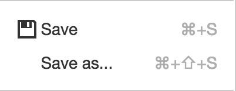
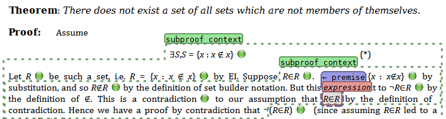

# Demo Apps and App Developer Tutorial

Jump to a section:
 * [Introduction](#introduction)
 * [Demo apps](#demo-apps)
 * [Tutorial](#tutorial)

## Introduction

### What can I build with this platform?

The webLurch [architecture](../README.md#a-development-platform) has three
tiers, applications at the top, built on the *Lurch Web Platform*, which in
turn is built on the WYSIWYG editor [TinyMCE](http://www.tinymce.com).
 * TinyMCE provides:
   * WYSIWYG editing of HTML content
     <br>
   * Extendability through custom toolbars, menus, dialogs, etc.
 * The *Lurch Web Platform* builds on that foundation, and provides:
   * [Load/Save functionality into the browser's
     LocalStorage](../app/loadsaveplugin.litcoffee)
     <br>
   * A WYSIWYG math editing widget, [imported from
     here](https://github.com/foraker/tinymce_equation_editor)
     <br>
   * __*Groups*__, the most important contribution of the *Lurch Web
     Platform*, [explained below](#what-are-groups).
   * Facilities for computing with groups, such as
     [a background computation/parallelization toolkit](../src/background.litcoffee)

### What are groups?

The crux of the user interface for the desktop version of Lurch is the
ability for the user to mark portions of a document as *meaningful* with
groups.

Groups are represented on screen as "bubbles," as in the images below.  Thus
the terms "group" and "bubble" are sometimes used interchangeably, but
technically "group" is the term for the object in memory, and "bubble" its
representation on screen.

Examples:
 * One demo app lets users wrap bubbles around mathematical expressions to
   tell Lurch to pay attention to the expressions' meaning.  Lurch puts a
   tag above the bubble to let the user see what the content means to Lurch.
   <br><br>
 * Another demo app lets users put bubbles around text to give it
   application-specific meaning.  The following screenshot is from an
   application for authoring OpenMath Content Dictionaries.
   <br>
 * Complex nested group hierarchies are possible and very useful.  Desktop
   Lurch uses them constantly:
   <br>

[Read about about the importance of this user interface
paradigm in a blog post about the desktop version of
Lurch.](http://lurchmath.org/2013/04/12/what-have-we-built-so-far-part-1-of-2/)

## Demo Apps

The content of this section got large enough to deserve
[its own page](http://nathancarter.github.io/weblurch/app/index.html).

## Tutorial

Build a *Lurch Web Application* as follows.
 * __Phase 1:__ Create a web page that imports the *Lurch Web Platform*.
 * __Phase 2:__ Write code that defines a set of group types.
 * __Phase 3:__ Optionally add new/custom behaviors to those types.

This section gives step-by-step instructions for creating your own *Lurch
Web Application.*  By the end of this section, you will have completed
Phases 1 and 2 on the list, and will know where to go to explore Phase 3.

### Phase 1: A first app (and a very simple one)

 1. Get a copy of this repository set up on your local machine.
    [See instructions here.](getting-started.md)  You may be able to forge
    ahead even if you've never tried to learn [literate
    CoffeeScript](www.coffeescript.org#literate), because the language is
    extremely readable.  But you can learn its basics at that link before
    proceeding if you prefer.
 1. Ensure that you can build and run the Simple Example app, as follows:
    * Compile the app and start a local web server by following the
      repository setup instructions in the previous bullet point.
    * Visit `http://localhost:8000/app/simple-example.html` to see the
      simple example app in action.
 1. Make a copy of that app to use as the basis for your own.
    * In the `app/` subfolder, make copies of the files
      `simple-example.html` and `simple-example-solo.litcoffee`, naming them
      something like `myapp.html` and `myapp-solo.litcoffee`.
    * Re-run `cake app` from the terminal to compile your new `.litcoffee`
      file.  (You will need to do this after each change to the source.)
      This should create several files that start with `app/myapp-solo`.
    * Change the last `<script>` tag in the `.html` file you just created so
      that it imports `myapp-solo.min.js` file rather than
      `simple-example-solo.min.js`.
    * Visit `http://localhost:8000/app/myapp.html` to ensure that this
      worked.  It should look exactly like the simple app you already saw.
 1. Edit `myapp-solo.min.js`.
    * The file begins with a lot of documentation, and then the first line
      of code is `setAppName 'ExampleApp'`.  Change the contents of the
      string to your app's name.
    * Rebuild using `cake app` and revisit the page to ensure that the app
      name in the browser's tab has changed to your app's name.

You've created a (very simple) app!  And you know how to change your app's
code, rebuild, and visit your updated app.  So what kinds of code changes
are possible?  Let's see.

### Phase 2: Changing or adding group types

The individual bubbles you see in the document are the visual representation
of what, under the hood, are called "groups."  Each app has a different set
of group types that the user may insert in the document, depending on the
needs of the application.  Examples:
 * In the simple app you have, there is only one group type, and it does
   almost nothing.  (It does write to the browser console, but that's
   hardly exciting.)
 * [The complex demo app](../app/complex-example-solo.litcoffee) defines two
   group types, one for wrapping and evaluating expressions of arithmetic
   and another for wrapping and doing simple computations on words.
 * In [the math demo app](.../app/math-example-solo.litcoffee) there is only
   one group type, for parsing and evaluating mathematical expressions.
 * In [the OpenMath Content Dictionary demo
   app](../app/openmath-example-solo.litcoffee) there is only one group
   type, but it can have any of over a dozen different purposes, editable
   using the context menu on each individual group.

If we look at the code in your app that defines group types, stripping away
all the documentation, it looks like the following.

```coffeescript
window.groupTypes = [
    name : 'reporter'
    text : 'Simple Event Reporter'
    imageHTML : '[ ]'
    openImageHTML : '['
    closeImageHTML : ']'
    tagContents : ( group ) ->
        "#{group.contentAsText()?.length} characters"
    contentsChanged : ( group, firstTime ) ->
        console.log 'This group just changed:', group.contentAsText()
]
```

All of this is fully documented [in the original
file](../app/simple-example-solo.litcoffee#define-one-group-type), so I do
not repeat here what any of it means.  But note that this is simply the
assignment to a global variable of an array of group type data.  You could
extend it to add another group type as follows.

```coffeescript
window.groupTypes = [
    #
    # This code is the same as before:
    #
    name : 'reporter'
    text : 'Simple Event Reporter'
    imageHTML : '[ ]'
    openImageHTML : '['
    closeImageHTML : ']'
    tagContents : ( group ) ->
        "#{group.contentAsText()?.length} characters"
    contentsChanged : ( group, firstTime ) ->
        console.log 'This group just changed:', group.contentAsText()
    #
    # Here begins the new code:
    #
,
    name : 'myNewGroupType'
    text : 'My New Group Type'
    imageHTML : '{}'
    openImageHTML : '{'
    closeImageHTML : '}'
    tagContents : ( group ) -> 'every tag has this content'
    # no event handler for changes to group contents
]
```

Rebuilding your app and reloading it in the browser should then let you
insert either of the two kinds of groups.  Each type should have its own
button on the toolbar.

By simply extending the list above, you can define any set of group types
you see fit in your application.  Note that the open and close HTML can be
arbitrary HTML, including (small) images and font colors and styles.

The only question that remains is how to make your groups do something
useful.

### Phase 3: Adding interactivity to your groups

What else can your app do?  Here are many examples, each with a link to
where you can read more information and see example code.

__Report information about the group on the bubble's tag__
 * Every example app you've seen so far does this.  Simply search the
   source code repository for the `tagContents` function and look at the
   variety of implementations.
 * In computing the contents of the tag, you will want to be able to query
   information about your group, such as its text content, or whether it
   has any groups inside of it.  The API for a Group object is [documented
   in the source code for the Groups
   Plugin](../app/groupsplugin.litcoffee).

__Customize a group's color__
 * Include among the key-value pairs in your group type definition a pair
   like `color : '#aacc00'`, or whatever HTML color you choose.

__Store and retrieve custom data in a Group object__
 * In the API linked to immediately above, see the `set`, `get`, and
   `clear` functions in the `Group` class.  These store arbitrary JSON
   data under string keys in a group.
 * It is very common to do a computation and store its result in an
   attribute of the group, the read that later when computing the contents
   of the group's tag, thus giving the user feedback on the results of
   some background process.

__Find what groups are in the document__
 * For a complete answer, see the API for the `Groups` class (different
   from the `Group` class!) in [the Groups
   Plugin](../app/groupsplugin.litcoffee).  Since that file is large, I
   give highlights here.
 * Access the one, global `Groups` object using the code
   `tinymce.activeEditor.Groups`.  I call this object `Groups` hereafter.
 * Get the array of all group IDs in your document (in the order their
   open boundaries appear in the document) with `Groups.ids()`.
 * Get the group object from its ID by indexing `Groups` as if it were an
   array, as in `Groups[putIdHere]`.
 * For any group `G`, get the group containing it with `G.parent`, which
   will be null if the group is top-level in the document, or if it was
   just created in the document (instants ago) and the editor has
   therefore not yet had a chance to re-scan and assign parent/child
   relationships.
 * For any group `G`, get an ordered array of the groups it (immediately)
   contains with `G.children`.  (Same caveat about just-created groups
   applies here.)

__Pushing complex computations into the background__
 * The *Lurch Web Platform* provides functionality for moving arbitrary
   computations into one or more background threads, with parallelization
   managed efficiently for you.  This lengthy topic is covered in two
   files:
 * [The "complex example" demo app](../app/complex-example-solo.litcoffee)
   pushes some computations into the background, and you can follow its
   example code.
 * [The background module](../src/background.litcoffee) documents the full
   API that's being leveraged by that demo app.

__Extending the menus that appear when users right-click a group or click
its bubble tag__
 * Extending a group's context menu is done by providing a
   `contextMenuItems` function in the group type definition.  Search the
   repository for that phrase to see examples.  One appears in [the
   source code for the complex example demo
   app](../app/complex-example-solo.litcoffee).
 * Extending a group's tag menu is done by providing a `tagMenuItems`
   function that behaves exactly the same way, but may choose to return a
   different list of menu items.

__Adding new buttons to the editor toolbar__
 * This is done by assigning to the global object
   `window.groupToolbarButtons`.
 * [See an example
   here.](../src/xml-groups-solo.litcoffee#define-one-toolbar-button)

__Adding new menu items to the editor's menus__
 * This is done by assigning to the global object
   `window.groupMenuItems`.
 * There is not an example of this at the moment, but it functions very
   similar to the previous bullet point, about toolbar buttons.  The
   implementation appears in
   [the main setup code](../app/setup.litcoffee).

__Showing dialog boxes__
 * [TinyMCE provides a few ways to show dialog boxes containing plain
   text](http://www.tinymce.com/wiki.php/api4:class.tinymce.WindowManager).
 * If your dialog box must contain more than just plain text, see
   [the Dialogs plugin](../app/dialogsplugin.litcoffee).

__Adding decorations to group boundaries__
 * It is common to give feedback to the user about the content of a group
   in a more obvious way than the bubble tag (which is only visible when
   the user's cursor is in the group).  For instance, if there is an
   error in what the user has entered in a group, you might want to
   flag it in an obvious way, as the <font color="red">&#10006;</font>
   does in the following example from
   [the OpenMath Content Dictionary Editor demo
   app](../app/openmath-example-solo.litcoffee).
   <br><br>
   This is a special case of "decorating" a group.  To add decorations to
   a group `G`, you have the following API.
 * `G.set 'openDecoration', 'any valid HTML here'` - sets the decoration
   that will appear to the left of its open boundary marker (not used in
   the image above)
 * `G.set 'closeDecoration', 'any valid HTML here'` - same as the previous
   but for after the close boundary marker (as in the image above)
 * `G.clear 'openDecoration'` and `G.clear 'closeDecoration'` behave as
   expected
 * Note that there are many useful Unicode characters for visually giving
   understandable feedback concisely.  Consider the following, each of
   which can be made more informative by wrapping it in
   `<font color="red">...</font>`, as in the image above,
   or some other color suiting your application.
   * X's
     * &amp;#10006; is &#10006;
     * &amp;#10007; is &#10007;
     * &amp;#10007; is &#10008;
   * Checks
     * &amp;#10003; is &#10003;
     * &amp;#10004; is &#10004;
   * Stars
     * &amp;#10029; is &#10029;
     * &amp;#10038; is &#10038;
     * &amp;#10039; is &#10039;
     * &amp;#10040; is &#10040;
     * &amp;#10041; is &#10041;
   * Numbers
     * &amp;#10122; is &#10122;
     * ... in order through ...
     * &amp;#10131; is &#10131;

### Other functionality

In this section I document other configuration possibilities beyond those
mentioned above, things that didn't fit neatly into the above categories.

To run any code after the editor has been set up, assign a function to the
global variable `window.afterEditorReady`.  Your function should accept a
single parameter, `editor`, which will be the editor object that was just
initialized.  Your function will be called at the end of the TinyMCE editor
"init" event.

-----

This tutorial was written by [Nathan Carter](mailto:ncarter@bentley.edu).
Feel free to contact me with questions.  I would love to know how we can
help get you started coding on the *Lurch Web Platform*.
